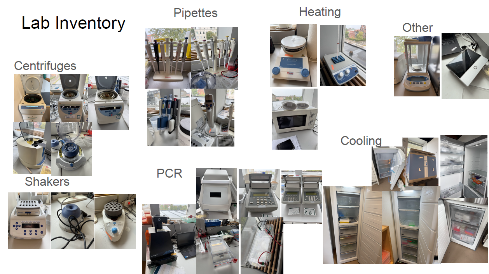

# Museomics
Molecular Laboratory for the Natural History Museum of Denmark

Welcome to the github for the Museomics Laboratory for the Natural History Museum of Denmark.

Here you can:

See commonly used protocols

 
  
* [Santa Cruz single stranded library prep for ancient DNA](https://www.protocols.io/view/santa-cruz-reaction-scr-single-stranded-ancient-dn-d4sc8waw.html) (used by Pete Hosner and bird genomics group) 

Schedule a time to use the laboratory

 
  
* [Book your lab time here](https://kunet.ku.dk/faculty-and-department/snm/research-and-external-consultancies/dnalab/Pages/Booking-calendar.aspx)
* Make sure to include your name, the workspace you will be using (ie bench, LAF1, LAF2 or fume hood), and any equipment you will need (ie centrifuge, Qubit, incubator)
* If you do not have access to KU net to book a time, email [Rebecca](rc@snm.ku.dk) to schedule a time.

See a list of available equipment

 

* Centrifuges:
  *	1 large (fits 4 96-well plates)—right now is set up for 50ml tubes—not sure where 96-well plate attachment is
  * Micro star 17R (fits 24 2mL tubes) –able to cool
  * Micro Star 17 (fits 24 2mL tubes)
  * VWR PCR Plate spinner (fits 2 96 well plates)
  * VWR Mini Star (9 2mL tubes)
* Shakers
  * Eppendorf ThermoMixer C: 24 2mL tubes
  * VELP scientifica wizard Advanced IR Vortex Mixer
  * Aldrich lab dancer (1 tube)
* Heating: 
  * VWR analog heatblock
  * Thermo Scientific Hotplate and magnetic stirrer
  * Microwave
* Pipettes
  * 2 sets of regular
  * Multichannel
    * 1-10uL,20-200uL, .2-2?
  * Eppendorf Multipette digital pippetter
* Cooling
  * 2 tall freezers with 6 drawers (Alexey)
  * 1 fridge/freezer combo (3 freezer drawers)-Alexey
  * Mini fridge 
  * B40 hybrid cooler with powerful compressor (continuous cooling from 12C to -15C and thermoelectric generator (max -20C)
* PCR
  * VWR Transilluuminator with imaging enclosure and camera (may need replacement)
  * Mastercycler X50i with laptop (Aslak)
  * 3 Applied biosystems 2720 Thermal Cycler
  * BioRad Gell electrophoresis PowerPac
  * BioRad gel tanks (1 old, 1 large, 1 small)
* Other
  * VWR Analytical Balances scale
  * Oxford nanopore minion
  * Old qPCR machine that DNA Liv doesn’t use anymore (but doesn’t work that well)

Order Supplies

 
  
* [This link might be a survey that goes to airtable]()

Read about our work

 

* [Link to publication from our group]()

For more information contact museomics laboratory manager [Rebecca Clement](rc@snm.ku.dk) 

