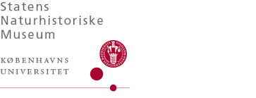

# Museomics
Molecular Laboratory for the Natural History Museum of Denmark

Welcome to the github for the Museomics Laboratory for the Natural History Museum of Denmark.

Here you can:

See commonly used protocols

 
  
* [Santa Cruz single stranded library prep for ancient DNA](https://www.protocols.io/view/santa-cruz-reaction-scr-single-stranded-ancient-dn-d4sc8waw.html) (used by Pete Hosner and bird genomics group) 

Order Supplies

 
* [This link might be a survey that goes to airtable]()

Read about our work

 
* [Link to publication from our group]()

For more information contact museomics laboratory manager [Rebecca Clement](rc@snm.ku.dk) 

